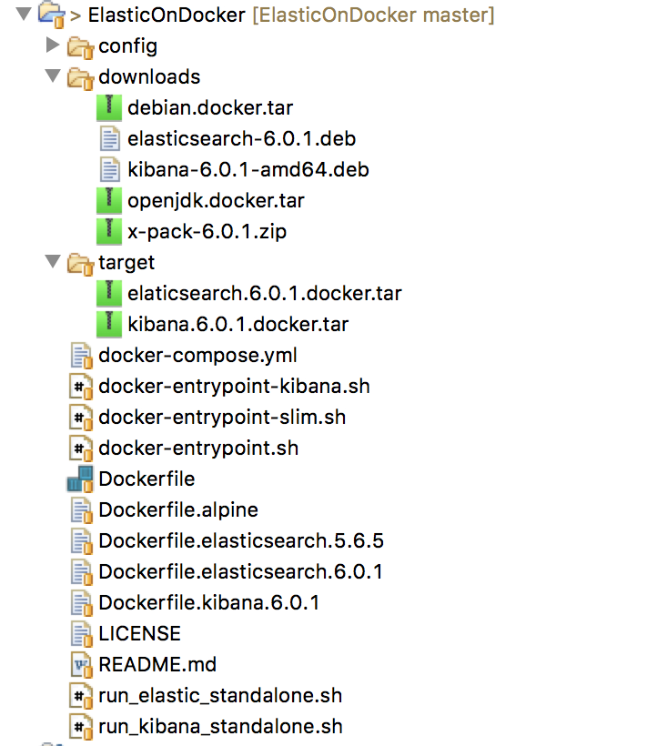

# Elastic on Docker


# Create Image

## Getting all artifacts for offline image creation

- bundle Elastic
- bundle x-pack
- bundle any plugin

- Linux Debian images pre-loaded in docker
- OpenJdk images pre-loaded in docker

Download all necessary file in such a way you have the following in download directory :




## Tooling when working with docker

When creating images with docker, one should be very prepared to cycle through the process of try and error, which is not usual in IT but with image creation we should balance between the will to drop everything in the contain to make it easy to develop and maintain and the basic principle of the container. Even though the tool may seem rudimentary for non unix expert but with the bare bone unix you can already accomplished a lot once you know the hidden treasure of unix. However it may still be convenient to drop tools like gosu 


- [gosu](https://github.com/tianon/gosu) : this tools allows you to interact with your docker container and make adjustment while developing. Not sure it is recommended for production as it may weaken the security. 
- [su-exec](https://github.com/ncopa/su-exec) is an alternative to `gosu`, gosu take 1.6mb while su-exec only 10kb (power of c over go  :facepunch: :clap:, it really matter if you want to make your image as small as possible without losing any good feature). The draw back is the need to compile it which can be challenging for user not use to c.
- Postman is your best friend, there is no better tools for development to build rest request in a very flexible way and make them portable on different environments.
- sed : this is where unix gets an edge over windows; windows has been built to click on mouse button, Unix has been built from the beginning to interact with efficient scripting or command capabilities, sed is exactly a nice introduction. Unix has a cohesive integration of shell and kernel. I am fan of 'awk family' (awk, nawk, gawk).

## Preparing the image : THE DOCKERFILE...S

up to version 5.6.5 elasticsearch used to publish the `dockerfile` to rebuild the docker image, from there it could have been customized to any needs. We can still find them [here](https://hub.docker.com/_/elasticsearch/). This is still good practice to be able to rebuild everything from scratch in case it needs to be tweaked or patched or even more to comply to some standard component to be used. We will start building our image from the last version published which is already a good base, we will comment the steps we don't need and will leave them in the code for reference.

> Minimize internet interaction
> It is in my opinion best to create images relying on file being downloaded prior to invoke docker build, it is inevitable that this will be the norm in the production environment.
> in this case we have to get the images of openjdk and debian linux, if you prefer using another linux version, up to you to change.

### list of artifacts before launching `DOCKER BUILD`

#### Docker configuration files

- [Kibana Dockerfile](./Dockerfile.kibana.6.0.1)
- [Elasticsearch Dockerfile](./Dockerfile.elasticsearch.6.0.1)

#### Docker Input Files

In order to build a docker image, very often a series of files are used in the built process, in this case we have the following files :

- Docker Entry point, this is the file that is used to define the steps the docker container should first execute when a image is brought up. It is not mandatory but it seems to have been a widely spread practice.
   - [Entry point for Elastic container](./docker-entrypoint.sh)
   - [Entry point for Kibana container](./docker-entrypoint-kibana.sh)
- Any configuration file that can serve as template in order to configure the container. Two approaches here in order to configure the container:
	1. configuration files with environment variables like [elasticsearch.yml](./config/elasticsearch.yml). Then environment variables can be setup at launch time or some in the entry point.
	2. use the the dockerfile with a series of command like `sed`, `awk` in order to change some of the configuration to fit your need.
	
> There is no good or  bad approach but the first one allows dynamic configuration the second one is really used at built phase. There is a third approach: keep the configuration file outside the container and mount them using a volume at run time. In this case, we see the benefit when the configuration is common to all running container. When the configuration needs to be specific to all container the 'volume mount'approach even though possible may be a little overkilled.

#### Building the docker images

#### `DOCKER BUILD`


``` 
# building Elasticsearch image
docker build . -f Dockerfile.elasticsearch.6.0.1 -t elasticsearch:6.0.1

# building Kibana image
docker build . -f Dockerfile.kibana.6.0.1 -t kibana:6.0.1
```

check images has been put in docker repository

```

> docker images
REPOSITORY           TAG                 IMAGE ID            CREATED             SIZE
elasticsearch        6.0.1               ddd73f2976d0        54 seconds ago      871MB
kibana               6.0.1               6b5f1232dc88        3 minutes ago       625MB
openjdk              8-jre               c49bf7000580        5 weeks ago         538MB
debian               jessie              2fe79f06fa6d        6 weeks ago         123MB

```

#### `DOCKER COMPOSE`

you will find the docker-compose file [here](./docker-compose.yml)


## Deployment and test 

The benefit of the 4 different deployments mode is to demonstrate how portable and flexible is the container. This makes it very convenient to avoid environment issue regardless of whether we use the container in development, test or production.

### Stand-alone

With Docker engine installed on one machine (or VM). For that you just need docker engine installed.

```
# launching elasticsearh
docker run --env NETWORK_HOST=_eth0_ --env ES_JAVA_OPTS="-Xms2G -Xmx2G" --env NODE_NAME=node1 -p 9200:9200 -p 9300:9300 -it elasticsearch:6.0.1

# launching kibana 
docker run --env NETWORK_HOST=_eth0_ --env ELASTICSEARCH_URL=http://<your-hostanme>:9200 --env ES_JAVA_OPTS="-Xms2G -Xmx2G" --env NODE_NAME=node1  -p 5601:5601 -it --rm kibana:6.0.1
```

> Note the usage of `NETWORK_HOST=_eth0_` :  this environment variable will set the corresponding variable in elasticsearch.yml. There are many ways to set that variables, it can be an IP adress, a hostname, or an inteface in the form or `_eth0_` or `_eth0:ipv4_`. This is important to mention the interface when the host has many interface, this can avoid confusion and avoid system to pick a random interface.

> Note that if you want to have all the list of variable that can be configure to change elastic behavior, you can edit the yml file. Furthermore, in addition to any specific variables of elastic, you can change pretty much whatever you want for the jvm.

> for simplicity, volumes have not been address by now. there will be later on.


This should work as if elastic would run natively on your machine.


### Virtualization using Docker-Machine


### Manual cluster deployment

TBD 


### Cluster with Docker Swarm mode


docker-compose

connect to docker machine 

sudo sysctl -w vm.max_map_count=262144
can be permanently changed follow the link

https://stackoverflow.com/questions/43082088/docker-machine-set-configuration-as-default


routing between vboxnet0 vboxnet1

MBP15:libexec rumi$ ip route add 192.168.99.101  dev en1
Executing: /usr/bin/sudo /sbin/route add 192.168.99.101 -interface en1
route: writing to routing socket: File exists
add host 192.168.99.101: gateway en1: File exists


#set ip of docker machine

in the docker machine with root

edit file /var/lib/boot2docker/

add the following line to bootsync.sh

ifconfig eth1 192.168.99.101 netmask 255.255.255.0 up                          


restart the machine


sysctl -w vm.max_map_count=262144
ps aglx | grep eth1 | grep -v grep | awk '{print $3}' | xargs kill
ifconfig eth1 192.168.99.101 netmask 255.255.255.0 up 


# Remark

docker compose file is sensitive to tabulation very much like python.


bin/x-pack/setup-passwords auto

